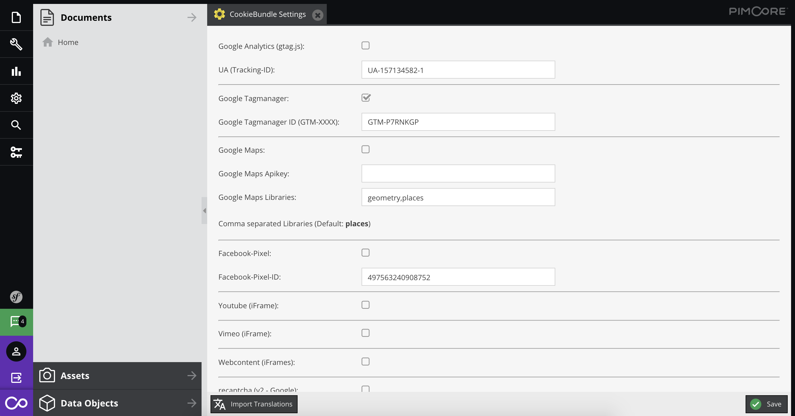

Pimcore CookieBundle
================

#### Supported Services:
- Google Analytics (gtag.js)
- Google Tag Manager
- Google Maps
- Google Maps (iFrame)
- Youtube (iFrame)
- Vimeo (iFrame)
- Webcontent (iFrame)

#### Requirements
* Pimcore >= 5.4

### Installation
composer require manbuv/cookie

### Installation via CommandLine
After installed the Bundle via composer:
- Execute: `$ bin/console pimcore:bundle:enable CookieBundle`

### Activate Cookie Consent
Add Attribute **cbcookie** in body Tag `<body cbcookie="1">`

---

#### Google Maps JavaScript API
 `

`

